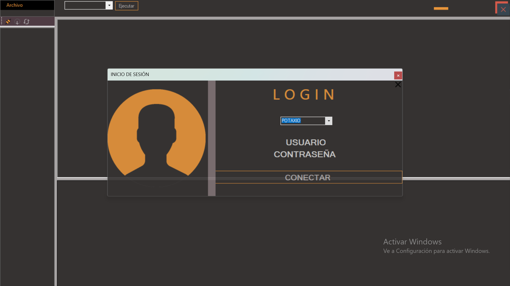

# Mini Sistema Gestor de Base de datos

 Gestor de base de datos que permite realizar operaciones básicas

Escritura y lectura de archivos de texto

Despliegue de las base de datos que contiene el servidor seleccionado

Soporte para realizar consultas (DML y DDL)  y remarcación de palabras reservadas

